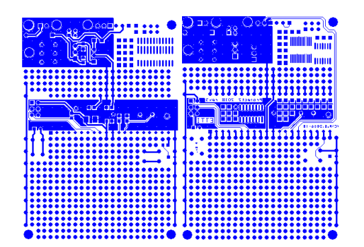
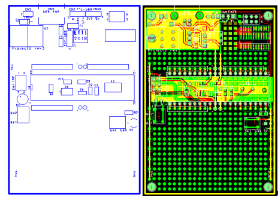
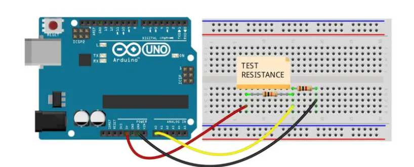

# Project: Ohmmeter: Electrical Resistance Measurement Device

## Overview

The Ohmmeter is an electrical measuring device designed to measure the resistance of any resistor and display the result on an LCD screen. Whether you are working with small or large resistances, this device provides an accurate measurement, making it an essential tool for electronic hobbyists and professionals alike.

## Features

- Precise Measurement: Accurately measures resistance values in Ohms (Ω).
- LCD Display: Resistance values are displayed clearly on the LCD for easy reading.
- Easy-to-Use Interface: Simply connect a resistor, and the Ohmmeter will automatically measure and display the resistance.
- Compact Design: Designed to be portable and efficient for on-the-go use.

## Project Details
- For using this project we need a resistence of 1 kohm, that is used as a default resistence to calculate the unknown one.
- Microcontroller: [ATmega 164a]
- Display: LCD Display (2x16)
- Power Supply: [Specify Power Source (Battery or USB)]

## Project Details

- **Board Design**  
  
- **Gerber Files 1**
  
- **Gerber File 2**
  
- **Schematic**
  

## How It Works
 1. Power up the device.
 2. Connect the resistors as shown in the Schematic photo.
 3. The Ohmmeter will automatically measure the resistance and display the result on the LCD screen.

## Conclusion

The Ohmmeter project offers a reliable and user-friendly solution for measuring electrical resistance. Its compact design and clear LCD display make it an essential tool for electronics enthusiasts and professionals alike. By following the instructions provided, you can easily build and utilize this device to enhance your understanding of electrical components. We encourage you to explore and modify the project to suit your needs, and we welcome any contributions or feedback to improve its functionality. Happy measuring!

